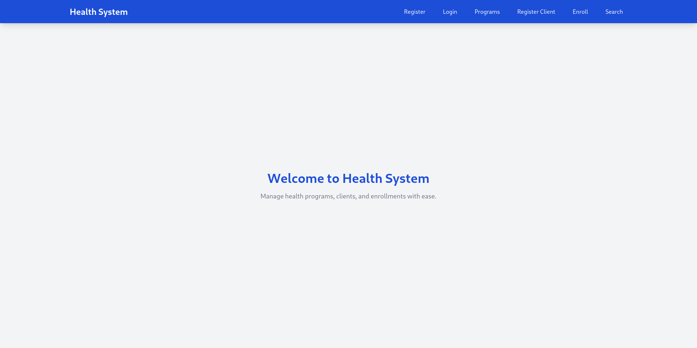
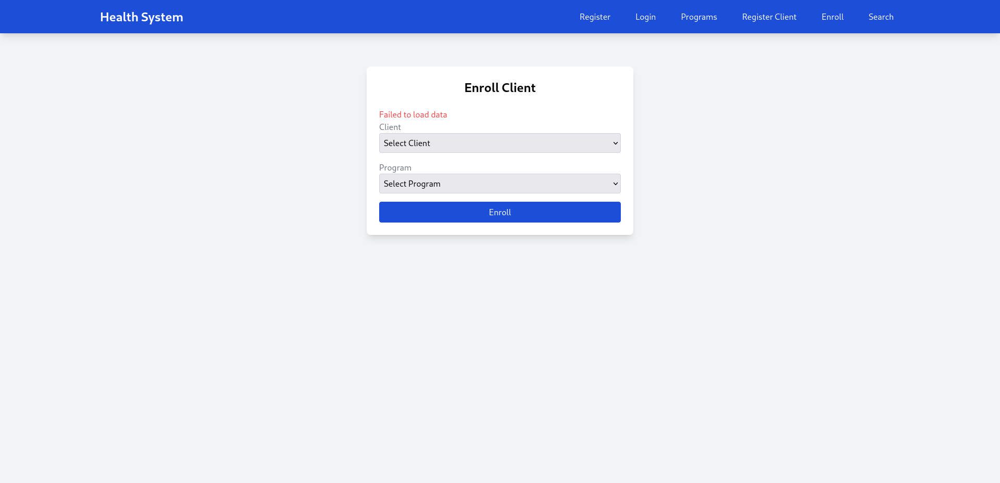

# Health Information System

A web application for managing health programs, client registrations, and enrollments. This system allows users to register, log in, create health programs, register clients, enroll clients in programs, and search for client profiles. Built with a modern MERN stack (MongoDB, Express, React, Node.js), it features a clean, responsive UI with Tailwind CSS and secure authentication using JWT.

## Table of Contents
- [Features](#features)
- [Tech Stack](#tech-stack)
- [Project Structure](#project-structure)
- [Prerequisites](#prerequisites)
- [Setup Instructions](#setup-instructions)
  - [Backend Setup](#backend-setup)
  - [Frontend Setup](#frontend-setup)
- [Usage](#usage)
- [API Integration](#api-integration)
- [Screenshots](#screenshots)
- [Contributing](#contributing)
- [License](#license)

## Features
- **User Authentication**: Register and log in with role-based access (user/admin) using JWT.
- **Health Program Management**: Create and manage health programs with names and descriptions.
- **Client Registration**: Register clients with details like name, date of birth, gender, and contact information.
- **Enrollment**: Enroll clients in health programs with a simple dropdown-based form.
- **Client Search**: Search for clients by name or ID and view their profiles, including enrollment history.
- **Responsive Design**: Clean, modern UI styled with Tailwind CSS, optimized for desktop and mobile.
- **Protected Routes**: Authentication required for sensitive actions like creating programs or enrolling clients.

## Tech Stack
- **Frontend**:
  - React 19.0.0
  - React Router 7.5.2
  - Tailwind CSS 3.4.14 (with PostCSS)
  - Axios 1.9.0 for API requests
  - Vite 6.3.1 for fast development and build
- **Backend** (assumed, adjust as needed):
  - Node.js
  - Express.js
  - MongoDB with Mongoose
  - JWT for authentication
- **Development Tools**:
  - ESLint for linting
  - PostCSS and Autoprefixer for CSS processing

## Project Structure
```

Health-Information-System/
├── backend/                   # Backend server
│   ├── src/                   # Source code
│   │   ├── config/            # Configuration files
│   │   │   └── db.js          # Database connection setup
│   │   ├── controllers/       # Request handlers
│   │   │   ├── auth.js        # Authentication handlers
│   │   │   ├── client.js      # Client handlers
│   │   │   ├── enrollment.js  # Enrollment handlers
│   │   │   └── healthProgram.js # Health program handlers
│   │   ├── middleware/        # Middleware functions
│   │   │   └── auth.js        # Authentication middleware
│   │   ├── models/            # Mongoose models
│   │   │   ├── Client.js      # Client schema
│   │   │   ├── Enrollment.js  # Enrollment schema
│   │   │   ├── HealthProgram.js # Health program schema
│   │   │   └── User.js        # User schema
│   │   ├── routes/            # Express routes
│   │   │   ├── authRoutes.js  # Authentication routes
│   │   │   ├── clientRoutes.js # Client routes
│   │   │   ├── enrollmentRoutes.js # Enrollment routes
│   │   │   └── healthRoutes.js # Health program routes
│   │   ├── tests/             # Test files (currently empty)
│   │   ├── app.js             # Express app setup
│   │   └── swagger.yaml       # API documentation (Swagger)
│   ├── package.json           # Backend dependencies
│   └── package-lock.json      # Dependency lock file
├── frontend/                  # Frontend React application
│   ├── public/                # Static assets
│   │   └── vite.svg           # Vite logo
│   ├── src/                   # Source code
│   │   ├── assets/            # Images and icons
│   │   │   └── react.svg      # React logo
│   │   ├── components/        # React components
│   │   │   ├── ClientForm.jsx
│   │   │   ├── ClientProfile.jsx
│   │   │   ├── ClientSearch.jsx
│   │   │   ├── EnrollmentForm.jsx
│   │   │   ├── Login.jsx
│   │   │   ├── ProgramForm.jsx
│   │   │   └── Register.jsx
│   │   ├── context/           # React Context for state management
│   │   │   └── AuthContext.jsx
│   │   ├── utils/             # Utility functions
│   │   │   └── api.js         # Axios instance for API requests
│   │   ├── App.jsx            # Main app component with routing
│   │   ├── index.css          # Global styles with Tailwind CSS
│   │   └── main.jsx           # Entry point for React
│   ├── package.json           # Frontend dependencies
│   ├── postcss.config.js      # PostCSS configuration
│   ├── tailwind.config.js     # Tailwind CSS configuration
│   └── vite.config.js         # Vite configuration
└── README.md                  # Project documentation
## Prerequisites
- **Node.js** (v18 or higher)
- **npm** (v9 or higher)
- **MongoDB** (local or cloud instance, e.g., MongoDB Atlas)
- A code editor (e.g., VS Code)

## Setup Instructions

### Backend Setup
1. **Navigate to the Backend Directory**:
   ```bash
   cd backend
   ```
2. **Install Dependencies**:
   ```bash
   npm install
   ```
3. **Configure Environment Variables**:
   - Create a `.env` file in the `backend/` directory.
   - Add the following:
     ```
     PORT=5000
     MONGO_URI=your_mongodb_connection_string
     JWT_SECRET=your_jwt_secret
     ```
   - Replace `your_mongodb_connection_string` with your MongoDB URI (e.g., `mongodb://localhost/health-system` or a MongoDB Atlas URI).
   - Replace `your_jwt_secret` with a secure secret key for JWT.
4. **Start the Backend Server**:
   ```bash
   npm start
   ```
   - The server should run on `http://localhost:5000`.

### Frontend Setup
1. **Navigate to the Frontend Directory**:
   ```bash
   cd frontend
   ```
2. **Install Dependencies**:
   ```bash
   npm install
   ```
3. **Start the Development Server**:
   ```bash
   npm run dev
   ```
   - The frontend should run on `http://localhost:5173`.

## Usage
1. **Register a User**:
   - Go to `http://localhost:5173/register`.
   - Fill in the username, password, and role (user/admin).
   - Submit to create an account.
2. **Log In**:
   - Go to `http://localhost:5173/login`.
   - Log in with your credentials.
   - You’ll be redirected to the search page.
3. **Create a Health Program**:
   - Navigate to `Programs` (`/programs`).
   - Enter a program name and description, then submit.
4. **Register a Client**:
   - Navigate to `Register Client` (`/clients`).
   - Fill in client details (first name, last name, date of birth, gender, contact).
5. **Enroll a Client**:
   - Navigate to `Enroll` (`/enroll`).
   - Select a client and program from the dropdowns, then submit.
6. **Search for Clients**:
   - Navigate to `Search` (`/search`).
   - Search for a client by name or ID.
   - Click on a client to view their profile and enrollment history.

## API Integration
The frontend communicates with the backend via a REST API at `http://localhost:5000/api`. Key endpoints include:

- **Authentication**:
  - `POST /api/auth/register`: Register a new user.
  - `POST /api/auth/login`: Log in and receive a JWT token.
- **Programs**:
  - `GET /api/programs`: Fetch all programs.
  - `POST /api/programs`: Create a new program.
- **Clients**:
  - `POST /api/clients`: Register a new client.
  - `GET /api/clients/search?query=term`: Search for clients.
  - `GET /api/clients/:id`: Get client details and enrollments.
- **Enrollments**:
  - `POST /api/enrollments`: Enroll a client in a program.

The `src/utils/api.js` file configures Axios to make requests with the correct base URL and Authorization header:
```javascript
import axios from 'axios';

const api = axios.create({
  baseURL: 'http://localhost:5000/api',
});

export const setAuthToken = (token) => {
  if (token) {
    api.defaults.headers.common['Authorization'] = `Bearer ${token}`;
  } else {
    delete api.defaults.headers.common['Authorization'];
  }
};

export default api;
```

## Screenshots
### Homepage

Welcome page with a clean, centered layout.

### Enroll Client

Form to enroll clients in programs, centered with modern styling.


## Contributing
1. Fork the repository.
2. Clone your fork:
   ```bash
   git clone https://github.com/your-username/Health-Information-System.git
   ```
3. Create a feature branch:
   ```bash
   git checkout -b feature/your-feature
   ```
4. Make changes and commit:
   ```bash
   git add .
   git commit -m "Add your feature"
   ```
5. Push to your fork:
   ```bash
   git push origin feature/your-feature
   ```
6. Open a pull request to the `main` branch.

## License
This project is licensed under the MIT License. See the [LICENSE](LICENSE) file for details.


---

